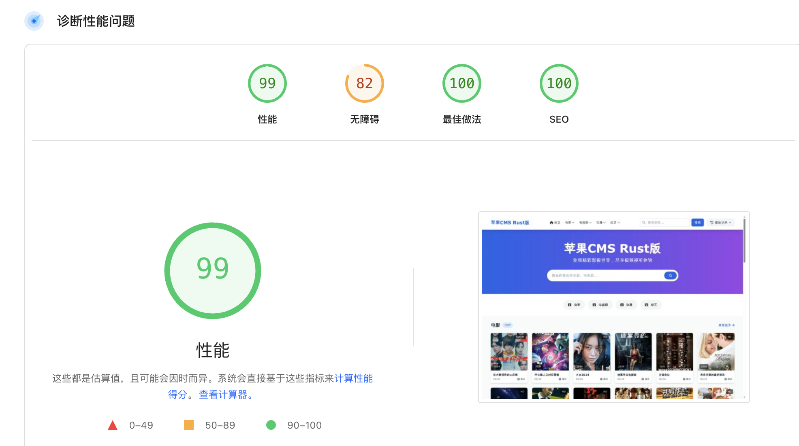

# FlowRust CMS



## Video Screenshot

[](https://raw.githubusercontent.com/TFTG-CLOUD/FlowRust/refs/heads/main/screenshot.mp4)

## 🚀 Project Introduction / 项目简介

FlowRust CMS is a high-performance multi-functional content management system (CMS) developed in Rust language, compatible with Mac CMS 10 collection APIs, focusing on performance, concurrent processing, and memory management, supporting various content forms including videos, audio, and image galleries.

FlowRust CMS 是基于 Rust 语言开发的高性能多功能内容管理系统（CMS），兼容苹果 CMS 10 采集接口，注重性能、并发处理和内存管理，支持视频、音频和图集漫画等多种内容形式。

It comes with a complete multi-server system for storage + multimedia processing (audio, video, images, archives): https://github.com/TFTG-CLOUD/cms-back. The CMS can connect to unlimited processing servers for unlimited scaling and horizontal expansion, supporting expansion for videos, audio, and image galleries.

拥有配套的完整储存+多媒体处理（音频，视频，图片，压缩包）的多服务器系统：https://github.com/TFTG-CLOUD/cms-back CMS 可对接无限个处理服务器，无限扩容，支持水平扩展，无论是视频、音频，图集漫画都能扩展。

### ✨ Core Advantages / 核心优势

- **🔥 Extreme Performance**: Under the same server configuration, concurrent processing capability is **10x+** that of traditional PHP CMS
- **🛡️ Memory Safety**: Guaranteed by Rust language, eliminating memory leaks and buffer overflows
- **⚡ Async Architecture**: Based on Tokio and Actix Web, supporting high-concurrency I/O operations
- **📊 Real-time Monitoring**: Built-in task progress monitoring and performance statistics
- **🎯 Backward Compatibility**: Fully compatible with Mac CMS database structure and APIs

- **🔥 极致性能**: 相同配置服务器下，并发处理能力是传统 PHP CMS 的 **10 倍以上**
- **🛡️ 内存安全**: Rust 语言保障，杜绝内存泄漏和缓冲区溢出
- **⚡ 异步架构**: 基于 Tokio 和 Actix Web，支持高并发 I/O 操作
- **📊 实时监控**: 内置任务进度监控和性能统计
- **🎯 向后兼容**: 完全兼容苹果 CMS 数据库结构和 API

## 📋 System Requirements / 系统要求

- **Operating System**: Linux/macOS/Windows
- **Memory**: Minimum 512MB, Recommended 2GB+
- **Storage**: Minimum 1GB available space
- **Database**: MongoDB 4.0+
- **Network**: Support for high-concurrency connections

- **操作系统**: Linux/macOS/Windows
- **内存**: 最低 512MB，推荐 2GB+
- **存储**: 最低 1GB 可用空间
- **数据库**: MongoDB 4.0+
- **网络**: 支持高并发连接

## 🚀 Quick Start / 快速开始

For production environments, it's recommended to install MongoDB first and then use the Release package for installation.

如果是生产环境，建议安装了 mongodb 之后，直接使用 Release 包安装。

### 1. Environment Setup / 环境准备

```bash
# Install Rust toolchain
curl --proto '=https' --tlsv1.2 -sSf https://sh.rustup.rs | sh

# Install MongoDB (Ubuntu/Debian)
sudo apt-get install gnupg curl
curl -fsSL https://www.mongodb.org/static/pgp/server-8.0.asc | \
   sudo gpg -o /usr/share/keyrings/mongodb-server-8.0.gpg \
   --dearmor

# Ubuntu 22.04 other versions refer to official documentation
echo "deb [ arch=amd64,arm64 signed-by=/usr/share/keyrings/mongodb-server-8.0.gpg ] https://repo.mongodb.org/apt/ubuntu jammy/mongodb-org/8.0 multiverse" | sudo tee /etc/apt/sources.list.d/mongodb-org-8.0.list

sudo apt update
sudo apt-get install -y mongodb-org

# Start MongoDB
sudo systemctl start mongod
```

```bash
# 安装 Rust 工具链
curl --proto '=https' --tlsv1.2 -sSf https://sh.rustup.rs | sh

# 安装 MongoDB (Ubuntu/Debian)
sudo apt-get install gnupg curl
curl -fsSL https://www.mongodb.org/static/pgp/server-8.0.asc | \
   sudo gpg -o /usr/share/keyrings/mongodb-server-8.0.gpg \
   --dearmor

# Ubuntu 22.04 其他版本参考官方文档
echo "deb [ arch=amd64,arm64 signed-by=/usr/share/keyrings/mongodb-server-8.0.gpg ] https://repo.mongodb.org/apt/ubuntu jammy/mongodb-org/8.0 multiverse" | sudo tee /etc/apt/sources.list.d/mongodb-org-8.0.list

sudo apt update
sudo apt-get install -y mongodb-org

# 启动 MongoDB
sudo systemctl start mongod
```

### 2. Clone Project / 克隆项目

```bash
git clone https://github.com/TFTG-CLOUD/FlowRust
cd FlowRust
```

### 3. Configure Environment Variables / 配置环境变量

```bash
# Edit configuration file
nano .env
```

Environment variable configuration example:

环境变量配置示例：

```env
# Database connection
DATABASE_URL=mongodb://localhost:27017
DATABASE_NAME=flowrust_cms

# Server configuration
SERVER_HOST=127.0.0.1
SERVER_PORT=8080

# Admin account
ADMIN_USER=admin
ADMIN_PASS=your_secure_password

# Session secret key
SESSION_SECRET_KEY=your_session_secret_key
```

```env
# 数据库连接
DATABASE_URL=mongodb://localhost:27017
DATABASE_NAME=flowrust_cms

# 服务器配置
SERVER_HOST=127.0.0.1
SERVER_PORT=8080

# 管理员账户
ADMIN_USER=admin
ADMIN_PASS=your_secure_password

# 会话密钥
SESSION_SECRET_KEY=your_session_secret_key
```

### 4. Build and Run / 编译运行

```bash
# Run in development mode
cargo run

# Compile in production mode
cargo build --release

# Copy production version to root directory
cp target/release/flowrust_cms ../../

# Run production version
./flowrust_cms
```

```bash
# 开发模式运行
cargo run

# 生产模式编译
cargo build --release

# 复制生产版本到根目录
cp target/release/flowrust_cms ../../

# 运行生产版本
./flowrust_cms
```

### 5. Access System / 访问系统

- **Frontend**: http://localhost:8080
- **Admin Backend**: http://localhost:8080/admin
- **API Endpoints**: http://localhost:8080/api

- **前台页面**: http://localhost:8080
- **管理后台**: http://localhost:8080/admin
- **API 接口**: http://localhost:8080/api

## 🏗️ System Architecture / 系统架构

### Technology Stack / 技术栈

- **Backend Framework**: Actix Web 4.x
- **Async Runtime**: Tokio 1.x
- **Database**: MongoDB 8.x
- **Template Engine**: Tera 1.x
- **Serialization**: Serde + Serde JSON
- **Password Encryption**: bcrypt
- **HTTP Client**: reqwest
- **Image Processing**: image + webp

- **后端框架**: Actix Web 4.x
- **异步运行时**: Tokio 1.x
- **数据库**: MongoDB 8.x
- **模板引擎**: Tera 1.x
- **序列化**: Serde + Serde JSON
- **密码加密**: bcrypt
- **HTTP 客户端**: reqwest
- **图片处理**: image + webp

### Project Structure / 项目结构

```
src/
├── main.rs              # Application entry point
├── models.rs            # Data models (Vod, Type, Collection, Binding, Config, etc.)
├── api_handlers.rs      # Frontend API interface handlers
├── web_handlers.rs      # Web page handlers
├── admin_handlers.rs    # Admin backend API handlers
├── collect_handlers.rs  # Collection function handlers
├── db.rs                # Database connection
├── auth.rs              # Authentication module
├── dto.rs               # Data transfer objects
├── template.rs          # Template rendering
├── index_manager.rs     # Index management
├── init_data.rs         # Initial data
└── site_data.rs         # Site data cache management
```

```
src/
├── main.rs              # 应用入口
├── models.rs            # 数据模型（Vod、Type、Collection、Binding、Config等）
├── api_handlers.rs      # 前台API接口处理器
├── web_handlers.rs      # Web页面处理器
├── admin_handlers.rs    # 管理后台API处理器
├── collect_handlers.rs  # 采集功能处理器
├── db.rs                # 数据库连接
├── auth.rs              # 认证模块
├── dto.rs               # 数据传输对象
├── template.rs          # 模板渲染
├── index_manager.rs     # 索引管理
├── init_data.rs         # 初始数据
└── site_data.rs         # 站点数据缓存管理
```

## 🔧 Core Features / 核心功能

### 1. Video Management / 视频管理

- ✅ Video CRUD operations
- ✅ Batch operations
- ✅ Status management (Published/Pending Review/Disabled)
- ✅ Category management
- ✅ Advanced search and filtering
- ✅ Pagination support (20-100 items per page)
- ✅ Sorting functionality

- ✅ 视频增删改查
- ✅ 批量操作
- ✅ 状态管理（已发布/待审核/已禁用）
- ✅ 分类管理
- ✅ 高级搜索和筛选
- ✅ 分页显示（支持每页 20-100 条）
- ✅ 排序功能

### 2. Category Management / 分类管理

- ✅ Multi-level category support
- ✅ Category binding
- ✅ Sorting and status control
- ✅ Template configuration

- ✅ 多级分类支持
- ✅ 分类绑定
- ✅ 排序和状态控制
- ✅ 模板配置

### 3. Collection System / 采集系统

- ✅ Multi-source collection support
- ✅ Real-time task monitoring
- ✅ Batch collection
- ✅ Image localization
- ✅ WebP format conversion
- ✅ Retry mechanism
- ✅ Progress tracking

- ✅ 多源采集支持
- ✅ 实时任务监控
- ✅ 批量采集
- ✅ 图片本地化
- ✅ WebP 格式转换
- ✅ 重试机制
- ✅ 进度追踪

### 4. Playback Source Management / 播放源管理

- ✅ Multi-playback source support
- ✅ Playback URL parsing
- ✅ Source status monitoring
- ✅ Automatic switching

- ✅ 多播放源支持
- ✅ 播放地址解析
- ✅ 源状态监控
- ✅ 自动切换

### 5. User System / 用户系统

- ✅ Admin login
- ✅ Session management
- ✅ Permission control
- ✅ Security authentication

- ✅ 管理员登录
- ✅ 会话管理
- ✅ 权限控制
- ✅ 安全认证

### 6. System Configuration / 系统配置

- ✅ Website configuration
- ✅ Collection configuration
- ✅ Playback configuration
- ✅ Template configuration

- ✅ 网站配置
- ✅ 采集配置
- ✅ 播放配置
- ✅ 模板配置

## 📊 Performance Comparison / 性能对比

### Benchmark Environment / 基准测试环境

- **Server**: 4-core 8GB RAM VPS
- **Database**: MongoDB 8.0
- **Testing Tool**: Apache Bench (ab)
- **Concurrency**: 1000
- **Requests**: 10000

- **服务器**: 4 核 8GB 内存 VPS
- **数据库**: MongoDB 8.0
- **测试工具**: Apache Bench (ab)
- **并发数**: 1000
- **请求数**: 10000

### Performance Metrics / 性能指标

Actually, the performance of the FlowRust version is even higher than shown in the chart!

实际上，FlowRust 版本的性能要比图示的更高！

| Metric / 指标                        | Traditional PHP CMS | FlowRust CMS | Improvement / 提升倍数 |
| ------------------------------------ | ------------------- | ------------ | ---------------------- |
| Concurrent Processing / 并发处理能力 | ~100 QPS            | ~1200 QPS    | **12x**                |
| Memory Usage / 内存使用              | ~512MB              | ~128MB       | **4x**                 |
| Response Time / 响应时间             | ~200ms              | ~15ms        | **13x**                |
| CPU Usage / CPU 使用率               | ~80%                | ~25%         | **3.2x**               |
| Database Queries / 数据库查询        | ~50ms               | ~5ms         | **10x**                |

### Performance Optimization Techniques / 性能优化技术

1. **Async I/O**: Non-blocking I/O based on Tokio
2. **Connection Pool**: MongoDB connection pool optimization
3. **Memory Management**: Rust zero-cost abstractions
4. **Index Optimization**: Automatic database index management
5. **Caching Strategy**: Intelligent caching mechanism
6. **Concurrency Model**: Actor model concurrent processing

7. **异步 I/O**: 基于 Tokio 的非阻塞 I/O
8. **连接池**: MongoDB 连接池优化
9. **内存管理**: Rust 零成本抽象
10. **索引优化**: 数据库索引自动管理
11. **缓存策略**: 智能缓存机制
12. **并发模型**: Actor 模型并发处理

## 🌐 API Endpoints / API 接口

### Admin Backend API / 管理后台 API

```bash
# Video Management / 视频管理
GET    /api/admin/vods              # Get video list (supports pagination, filtering, search)
POST   /api/admin/vods              # Create video
PUT    /api/admin/vods/{id}         # Update video
DELETE /api/admin/vods/{id}         # Delete video
DELETE /api/admin/vods              # Batch delete videos

# Category Management / 分类管理
GET    /api/admin/types             # Get category list
POST   /api/admin/types             # Create category
PUT    /api/admin/types/{id}        # Update category
DELETE /api/admin/types/{id}        # Delete category

# Collection Management / 采集管理
GET    /api/admin/collections       # Get collection source list
POST   /api/admin/collections       # Create collection source
PUT    /api/admin/collections/{id}  # Update collection source
DELETE /api/admin/collections/{id}  # Delete collection source
POST   /api/admin/collections/{id}/collect  # Start collection
GET    /api/admin/collections/{id}/binding-status  # Get collection source binding status

# Category Binding Management / 分类绑定管理
GET    /api/admin/bindings          # Get binding list
POST   /api/admin/bindings          # Create/update binding

# Website Configuration Management / 网站配置管理
GET    /api/admin/configs           # Get configuration list
POST   /api/admin/configs           # Create configuration
PUT    /api/admin/configs/{key}     # Update configuration
DELETE /api/admin/configs/{key}     # Delete configuration
GET    /api/admin/configs/{key}      # Get single configuration

# Collection Task Management / 采集任务管理
GET    /api/admin/collect/progress/{task_id}  # Get collection progress
GET    /api/admin/running-tasks     # Get running tasks
POST   /api/admin/collect/stop/{task_id}     # Stop collection task

# Index Management / 索引管理
POST   /api/admin/indexes/create    # Create indexes
GET    /api/admin/indexes/status    # Index status check
GET    /api/admin/indexes/list      # List all indexes

# System Statistics / 系统统计
GET    /api/admin/statistics        # Get system statistics

# 视频管理
GET    /api/admin/vods              # 获取视频列表（支持分页、筛选、搜索）
POST   /api/admin/vods              # 创建视频
PUT    /api/admin/vods/{id}         # 更新视频
DELETE /api/admin/vods/{id}         # 删除视频
DELETE /api/admin/vods              # 批量删除视频

# 分类管理
GET    /api/admin/types             # 获取分类列表
POST   /api/admin/types             # 创建分类
PUT    /api/admin/types/{id}        # 更新分类
DELETE /api/admin/types/{id}        # 删除分类

# 采集管理
GET    /api/admin/collections       # 获取采集源列表
POST   /api/admin/collections       # 创建采集源
PUT    /api/admin/collections/{id}  # 更新采集源
DELETE /api/admin/collections/{id}  # 删除采集源
POST   /api/admin/collections/{id}/collect  # 启动采集
GET    /api/admin/collections/{id}/binding-status  # 获取采集源绑定状态

# 分类绑定管理
GET    /api/admin/bindings          # 获取绑定列表
POST   /api/admin/bindings          # 创建/更新绑定

# 网站配置管理
GET    /api/admin/configs           # 获取配置列表
POST   /api/admin/configs           # 创建配置
PUT    /api/admin/configs/{key}     # 更新配置
DELETE /api/admin/configs/{key}     # 删除配置
GET    /api/admin/configs/{key}      # 获取单个配置

# 采集任务管理
GET    /api/admin/collect/progress/{task_id}  # 获取采集进度
GET    /api/admin/running-tasks     # 获取运行中的任务
POST   /api/admin/collect/stop/{task_id}     # 停止采集任务

# 索引管理
POST   /api/admin/indexes/create    # 创建索引
GET    /api/admin/indexes/status    # 索引状态检查
GET    /api/admin/indexes/list      # 列出所有索引

# 系统统计
GET    /api/admin/statistics        # 获取系统统计信息
```

### Frontend API / 前台 API

```bash
# Video APIs / 视频接口
GET    /api/provide/vod             # Video data provider interface (MacCMS compatible)
GET    /api/videos/{type_id}        # Get videos by category
GET    /api/videos/detail/{vod_id}  # Video details
GET    /api/categories/hierarchy    # Category hierarchy structure
GET    /api/filter-options          # Filter options

# Basic APIs / 基础接口
GET    /vods                        # Get video list (simplified version)

# 视频接口
GET    /api/provide/vod             # 视频数据提供接口（MacCMS兼容）
GET    /api/videos/{type_id}        # 按分类获取视频
GET    /api/videos/detail/{vod_id}  # 视频详情
GET    /api/categories/hierarchy    # 分类层级结构
GET    /api/filter-options          # 筛选选项

# 基础接口
GET    /vods                        # 获取视频列表（简化版）
```

### Collection API / 采集 API

```bash
# Collection APIs / 采集接口
GET    /api/collect/categories      # Get collection source categories
GET    /api/collect/videos          # Get collection source video list
POST   /api/collect/start           # Start collection task
GET    /api/collect/progress/{task_id}  # Get collection progress
POST   /api/collect/stop/{task_id}  # Stop collection task

# 采集接口
GET    /api/collect/categories      # 获取采集源分类
GET    /api/collect/videos          # 获取采集源视频列表
POST   /api/collect/start           # 开始采集任务
GET    /api/collect/progress/{task_id}  # 获取采集进度
POST   /api/collect/stop/{task_id}  # 停止采集任务
```

### Pagination Query Example / 分页查询示例

```javascript
// Get video list (page 2, 20 items per page, category ID 1, status published)
// 获取视频列表（第2页，每页20条，分类ID为1，状态为已发布）
fetch("/api/admin/vods?page=2&limit=20&type_id=1&status=1&search=关键词")
  .then((response) => response.json())
  .then((data) => {
    console.log(data);
    // {
    //   "code": 1,
    //   "msg": "success",
    //   "page": 2,
    //   "limit": 20,
    //   "total": 100,
    //   "videos": [...]
    // }
  });
```

## 🔧 Deployment Guide / 部署指南

### Release Package Installation (Recommended) / Release 包安装（推荐）

This is the simplest deployment method, suitable for rapid production deployment.

这是最简单的部署方式，适合生产环境快速部署。

#### 1. Download Release Package / 下载 Release 包

```bash
# Download the latest Linux binary package
wget https://github.com/TFTG-CLOUD/FlowRust/releases/latest/download/linux.zip

# Extract to target directory
sudo mkdir -p /opt/flowrust_cms
sudo unzip linux.zip -d /opt/flowrust_cms
cd /opt/flowrust_cms
```

```bash
# 下载最新版本的 Linux 二进制包
wget https://github.com/TFTG-CLOUD/FlowRust/releases/latest/download/linux.zip

# 解压到目标目录
sudo mkdir -p /opt/flowrust_cms
sudo unzip linux.zip -d /opt/flowrust_cms
cd /opt/flowrust_cms
```

#### 2. Create Configuration File / 创建配置文件

```bash
# Create environment variable configuration file
sudo nano .env
```

```bash
# 创建环境变量配置文件
sudo nano .env
```

Configuration file content:

配置文件内容：

```env
# Database connection
DATABASE_URL=mongodb://localhost:27017
DATABASE_NAME=flowrust_cms

# Server configuration
SERVER_HOST=0.0.0.0
SERVER_PORT=8080

# Admin account
ADMIN_USER=admin
ADMIN_PASS=your_secure_password

# Session secret key (please change to random string)
SESSION_SECRET_KEY=your_random_session_secret_key_here

# Log level
RUST_LOG=info
```

```env
# 数据库连接
DATABASE_URL=mongodb://localhost:27017
DATABASE_NAME=flowrust_cms

# 服务器配置
SERVER_HOST=0.0.0.0
SERVER_PORT=8080

# 管理员账户
ADMIN_USER=admin
ADMIN_PASS=your_secure_password

# 会话密钥（请修改为随机字符串）
SESSION_SECRET_KEY=your_random_session_secret_key_here

# 日志级别
RUST_LOG=info
```

#### 3. Set Permissions / 设置权限

```bash
# Set binary file execution permissions
sudo chmod +x flowrust_cms

# Create dedicated user (optional, recommended)
sudo useradd -r -s /bin/false flowrust
sudo chown -R flowrust:flowrust /opt/flowrust_cms
```

```bash
# 设置二进制文件执行权限
sudo chmod +x flowrust_cms

# 创建专用用户（可选，推荐）
sudo useradd -r -s /bin/false flowrust
sudo chown -R flowrust:flowrust /opt/flowrust_cms
```

#### 4. Startup Methods / 启动方式

**Method 1: Use nohup to run in background / 方式一：使用 nohup 后台运行**

```bash
# Switch to application directory
cd /opt/flowrust_cms

# Start in background
nohup ./flowrust_cms > flowrust.log 2>&1 &

# Check process status
ps aux | grep flowrust_cms

# View logs
tail -f flowrust.log
```

```bash
# 切换到应用目录
cd /opt/flowrust_cms

# 后台启动
nohup ./flowrust_cms > flowrust.log 2>&1 &

# 查看进程状态
ps aux | grep flowrust_cms

# 查看日志
tail -f flowrust.log
```

**Method 2: Use systemctl service management (Recommended) / 方式二：使用 systemctl 服务管理（推荐）**

Create service user (read/write access to flowrust_cms folder only):

创建服务用户（仅支持读写 flowrust_cms 文件夹）：

```bash
sudo useradd -r -s /bin/false -m -d /opt/flowrust_cms flowrust
sudo groupadd flowrust
sudo usermod -aG flowrust flowrust
sudo chown -R flowrust:flowrust /opt/flowrust_cms
sudo chmod -R u+rwX /opt/flowrust_cms
sudo chmod +x /opt/flowrust_cms/flowrust_cms
```

Create systemd service file:

创建 systemd 服务文件：

```bash
sudo nano /etc/systemd/system/flowrust-cms.service
```

Service configuration content:

服务配置内容：

```ini
[Unit]
Description=FlowRust CMS

[Service]
Type=simple
User=flowrust
Group=flowrust
WorkingDirectory=/opt/flowrust_cms
ExecStart=/opt/flowrust_cms/flowrust_cms
Restart=always
RestartSec=10
KillMode=mixed
KillSignal=SIGTERM

# Environment variables
Environment=RUST_LOG=info

# Security settings
NoNewPrivileges=true
PrivateTmp=true
ProtectSystem=strict
ReadWritePaths=/opt/flowrust_cms

[Install]
WantedBy=multi-user.target
```

Start and manage services:

启动和管理服务：

```bash
# Reload systemd configuration
sudo systemctl daemon-reload

# Start service
sudo systemctl start flowrust-cms

# Enable auto-start on boot
sudo systemctl enable flowrust-cms

# Check service status
sudo systemctl status flowrust-cms

# View service logs
sudo journalctl -u flowrust-cms -f

# Restart service
sudo systemctl restart flowrust-cms

# Stop service
sudo systemctl stop flowrust-cms
```

```bash
# 重新加载 systemd 配置
sudo systemctl daemon-reload

# 启动服务
sudo systemctl start flowrust-cms

# 设置开机自启
sudo systemctl enable flowrust-cms

# 查看服务状态
sudo systemctl status flowrust-cms

# 查看服务日志
sudo journalctl -u flowrust-cms -f

# 重启服务
sudo systemctl restart flowrust-cms

# 停止服务
sudo systemctl stop flowrust-cms
```

#### 5. Verify Deployment / 验证部署

```bash
# Check if service is running properly
curl http://localhost:8080/api/health

# Access admin backend
# Browser open: http://your-server-ip:8080/admin
```

```bash
# 检查服务是否正常运行
curl http://localhost:8080/api/health

# 访问管理后台
# 浏览器打开: http://your-server-ip:8080/admin
```

#### 6. Firewall Configuration / 防火墙配置

```bash
# Ubuntu/Debian
sudo ufw allow 8080

# CentOS/RHEL
sudo firewall-cmd --permanent --add-port=8080/tcp
sudo firewall-cmd --reload
```

#### 7. Install Caddy Reverse Proxy / 安装 caddy 反代

```bash
# Ubuntu
sudo apt install -y debian-keyring debian-archive-keyring apt-transport-https curl
curl -1sLf 'https://dl.cloudsmith.io/public/caddy/stable/gpg.key' | sudo gpg --dearmor -o /usr/share/keyrings/caddy-stable-archive-keyring.gpg
curl -1sLf 'https://dl.cloudsmith.io/public/caddy/stable/debian.deb.txt' | sudo tee /etc/apt/sources.list.d/caddy-stable.list
chmod o+r /usr/share/keyrings/caddy-stable-archive-keyring.gpg
chmod o+r /etc/apt/sources.list.d/caddy-stable.list
sudo apt update
sudo apt install caddy
```

Configuration content:

配置内容：

```
cd /etc/caddy
vim Caddyfile
# First resolve domain to server IP at domain registrar
# 先去域名注册商解析域名到服务器IP
# Reverse proxy configuration
https://rust-maccms.cc, https://www.rust-maccms.cc {
    reverse_proxy 127.0.0.1:8080
}
# Restart caddy
caddy reload
```

Start Caddy:

启动 caddy：

```bash
systemctl start caddy
systemctl enable caddy
```

### Docker Deployment (Recommended) / Docker 部署（推荐）

This is the simplest deployment method, integrating MongoDB 8 with automatic configuration, suitable for rapid deployment and testing.

这是最简单的部署方式，集成了 MongoDB 8 和自动配置，适合快速部署和测试。

```bash
# Install Docker
curl -sSL https://get.docker.com/ | sh
systemctl start docker
systemctl enable docker

# Create project folder
mkdir -p /home/flowrust-cms

# Enter folder, download Dockerfile
cd /home/flowrust-cms
wget https://raw.githubusercontent.com/TFTG-CLOUD/FlowRust/refs/heads/main/Dockerfile
wget https://raw.githubusercontent.com/TFTG-CLOUD/FlowRust/refs/heads/main/entrypoint.sh

# Build Docker image
docker build -t flowrust-cms:latest .

# Start container
docker run -d \
  --name flowrust-cms \
  -p 8080:8080 \
  -e ADMIN_USER=myuser \
  -e ADMIN_PASS=mypassword \
  -v ./flowrust_data:/var/lib/mongodb \
  -v ./flowrust-cms:/app \
  -v ./flowrust_logs:/var/log \
  --restart unless-stopped \
  flowrust-cms:latest

# Parameter and folder descriptions
ADMIN_USER Set backend username
ADMIN_PASS Set backend password, recommend complexity
./flowrust_data Database folder, can be backed up manually
./flowrust-cms Program source code directory
./flowrust_logs Related runtime logs

# View container status
docker ps

# View logs
docker logs flowrust-cms

# Stop container
docker stop flowrust-cms

# Start container
docker start flowrust-cms

# Restart container
docker restart flowrust-cms

# Delete container
docker rm flowrust-cms

# Enter container
docker exec -it flowrust-cms /bin/bash
```

```bash
# 安装docker
curl -sSL https://get.docker.com/ | sh
systemctl start docker
systemctl enable docker

# 创建项目文件夹
mkdir -p /home/flowrust-cms

#进入文件夹，下载Dockerfile
cd /home/flowrust-cms
wget https://raw.githubusercontent.com/TFTG-CLOUD/FlowRust/refs/heads/main/Dockerfile
wget https://raw.githubusercontent.com/TFTG-CLOUD/FlowRust/refs/heads/main/entrypoint.sh

# 构建 Docker 镜像
docker build -t flowrust-cms:latest .
#启动镜像
docker run -d \
  --name flowrust-cms \
  -p 8080:8080 \
  -e ADMIN_USER=myuser \
  -e ADMIN_PASS=mypassword \
  -v ./flowrust_data:/var/lib/mongodb \
  -v ./flowrust-cms:/app \
  -v ./flowrust_logs:/var/log \
  --restart unless-stopped \
  flowrust-cms:latest

#相关参数和文件夹说明
ADMIN_USER 设置后台用户名
ADMIN_PASS 设置后台密码，推荐复杂点
./flowrust_data 数据库文件夹，可自行备份
./flowrust-cms 程序源码目录
./flowrust_logs 相关运行日志

# 查看容器状态
docker ps

# 查看日志
docker logs flowrust-cms

# 停止容器
docker stop flowrust-cms

# 启动容器
docker start flowrust-cms

# 重启容器
docker restart flowrust-cms

# 删除容器
docker rm flowrust-cms

# 进入容器
docker exec -it flowrust-cms /bin/bash
```

## 🛠️ Development Guide / 开发指南

### Development Environment Setup / 开发环境设置

```bash
# Install development dependencies
cargo install cargo-watch cargo-expand

# Development mode with auto-reload
cargo watch -x run

# Code formatting
cargo fmt

# Code linting
cargo clippy

# Generate documentation
cargo doc --no-deps
```

```bash
# 安装开发依赖
cargo install cargo-watch cargo-expand

# 开发模式自动重载
cargo watch -x run

# 代码格式化
cargo fmt

# 代码检查
cargo clippy

# 生成文档
cargo doc --no-deps
```

### Database Migration / 数据库迁移

```bash
# Create indexes
curl -X POST http://localhost:8080/api/admin/indexes/create

# Check index status
curl -X GET http://localhost:8080/api/admin/indexes/status
```

```bash
# 创建索引
curl -X POST http://localhost:8080/api/admin/indexes/create

# 检查索引状态
curl -X GET http://localhost:8080/api/admin/indexes/status
```

### Testing / 测试

```bash
# Run all tests
cargo test

# Run integration tests
cargo test --test integration_tests
```

```bash
# 运行所有测试
cargo test

# 运行集成测试
cargo test --test integration_tests
```

## 🔍 Monitoring and Logging / 监控和日志

### Performance Monitoring / 性能监控

The system has built-in real-time monitoring capabilities:

系统内置了实时监控功能：

- **Task Progress**: Real-time display of collection task progress
- **System Statistics**: Database statistics, user statistics
- **Error Logs**: Detailed error information and stack traces
- **Performance Metrics**: Response time, concurrency, memory usage

- **任务进度**: 实时显示采集任务进度
- **系统统计**: 数据库统计、用户统计
- **错误日志**: 详细的错误信息和堆栈跟踪
- **性能指标**: 响应时间、并发数、内存使用

### Log Configuration / 日志配置

```rust
// Set log level
RUST_LOG=info cargo run

// Output to file
RUST_LOG=info cargo run > maccms.log 2>&1
```

```rust
// 设置日志级别
RUST_LOG=info cargo run

// 输出到文件
RUST_LOG=info cargo run > maccms.log 2>&1
```

## 🤝 Contribution Guide / 贡献指南

1. Fork the project
2. Create a feature branch (`git checkout -b feature/AmazingFeature`)
3. Commit your changes (`git commit -m 'Add some AmazingFeature'`)
4. Push to the branch (`git push origin feature/AmazingFeature`)
5. Create a Pull Request

6. Fork 项目
7. 创建功能分支 (`git checkout -b feature/AmazingFeature`)
8. 提交更改 (`git commit -m 'Add some AmazingFeature'`)
9. 推送到分支 (`git push origin feature/AmazingFeature`)
10. 创建 Pull Request

## 📄 License / 许可证

This project is licensed under the MIT License - see the [LICENSE](LICENSE) file for details.

本项目采用 MIT 许可证 - 查看 [LICENSE](LICENSE) 文件了解详情。

## 🆘 Technical Support / 技术支持

If you encounter issues during use, please:

如果您在使用过程中遇到问题，请：

1. Check the FAQ section in this documentation
2. Search existing Issues
3. Create a new Issue describing the problem
4. Contact the technical support team

5. 查看本文档的常见问题部分
6. 搜索已有的 Issues
7. 创建新的 Issue 描述问题
8. 联系技术支持团队

## 🔄 Upgrade Guide / 升级指南

### Migration from Traditional PHP CMS / 从传统 PHP CMS 迁移

1. **Data Migration**: Use the collection API provided by Mac CMS directly for data migration

1. **数据迁移**: 直接使用苹果 CMS 提供的采集 API 进行数据迁移

### Version Upgrade / 版本升级

```bash
# Backup database
mongodump --db flowrust_cms --out backup/

# Update code
git pull origin main

# Rebuild
cargo build --release

# Restart service
sudo systemctl restart flowrust-cms
```

```bash
# 备份数据库
mongodump --db flowrust_cms --out backup/

# 更新代码
git pull origin main

# 重新编译
cargo build --release

# 重启服务
sudo systemctl restart flowrust-cms
```

## 📈 Future Plans / 未来规划

- [ ] Video transcoding service
- [ ] CDN integration
- [ ] Multi-language support
- [ ] Mobile API
- [ ] Plugin system
- [ ] Microservices architecture
- [ ] Containerized deployment
- [ ] Load balancing

- [ ] 视频转码服务
- [ ] CDN 集成
- [ ] 多语言支持
- [ ] 移动端 API
- [ ] 插件系统
- [ ] 微服务架构
- [ ] 容器化部署
- [ ] 负载均衡

---

**FlowRust CMS** - A high-performance video content management system built for modern web

**FlowRust CMS** - 为现代 Web 而生的高性能视频内容管理系统
